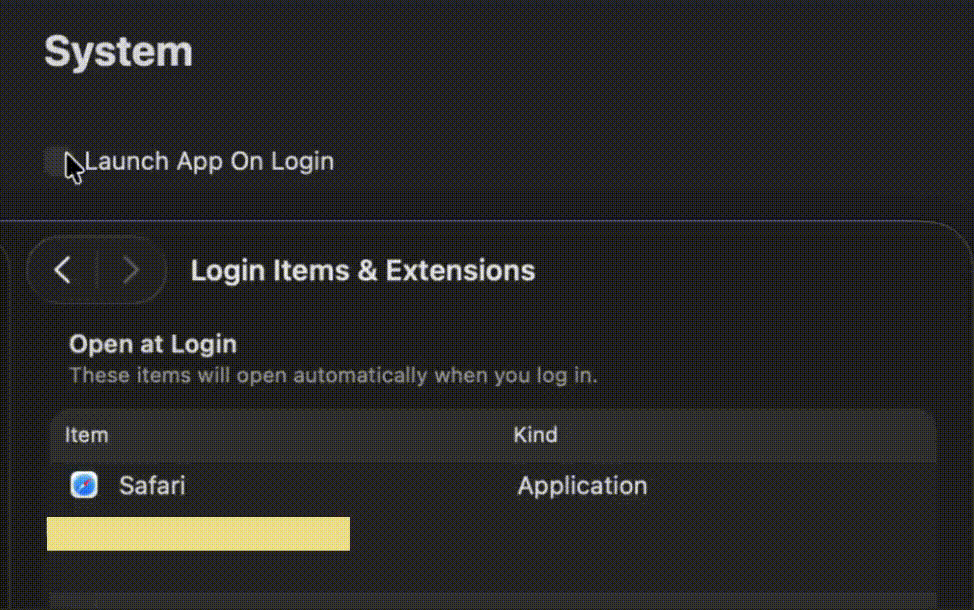

# SwiftUI_MacOS_LaunchAtLogin
A demo of how to register or unregister our app as login items so that it can be launched at user login, as well as watching for some changes..

For more details, please refer to my blog[Little SwiftUI/MacOS Tip: Launch App At Login]()

